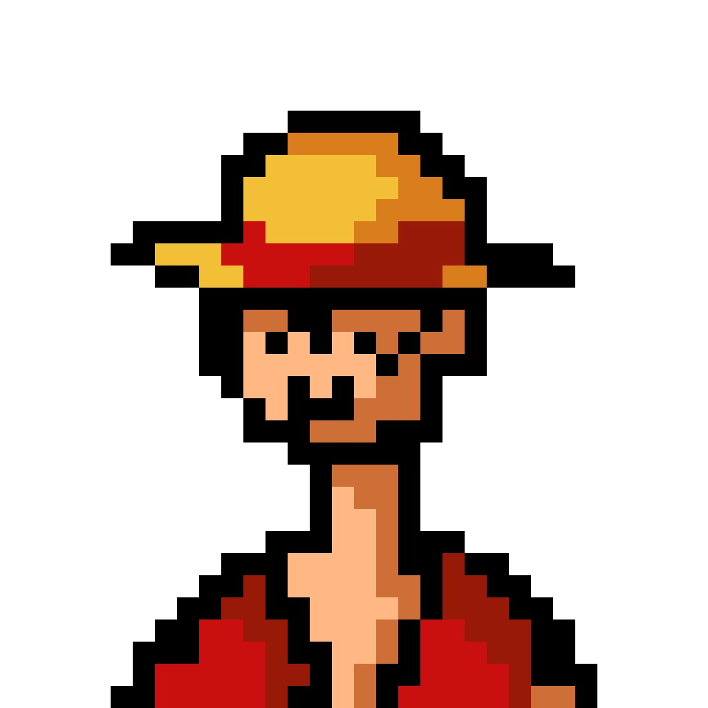

    <h1 align="left">😎 Renan Bez</h1>
    

**`Entusiasta em Desenvolvimento Web [Estudante de Graduação | Desenvolvedor Front End | 3D Visuals]`**

Bem-vindo ao meu perfil do Github, sou o Renan! Como estudante de ciência da computação altamente motivado e disciplinado, estou profundamente comprometido em seguir uma carreira no desenvolvimento front end. Através de uma combinação de estudos autodidatas e colaboração com meus colegas, estou continuamente trabalhando para aprimorar minhas habilidades e alcançar meu objetivo de me tornar um desenvolvedor completo.

Meu portfólio no GitHub mostra uma variedade de projetos de programação, incluindo aqueles que desenvolvi de forma independente, aqueles inspirados em recursos instrucionais e aqueles criados em colaboração com outros desenvolvedores em ascensão. Para obter uma visão abrangente de minhas qualificações e expertise, recomendo que você visite meu [site de portfólio](https://www.renanbez.com/).

    
    
    
    

 
<h2 align="left">🌟 Linguagens e Ferramentas</h2>

    
    
    
    
    
    
    
    
    
    
    
    
    
    
    
    
    

 
<h2 align="left">📊 Estatísticas do GitHub</h2>

 
 
<h2 align="left">🧰 Principais Linguagens Utilizadas</h2>

 
<h2 align="left">🐍 Contribuição no GitHub</h2>

    

